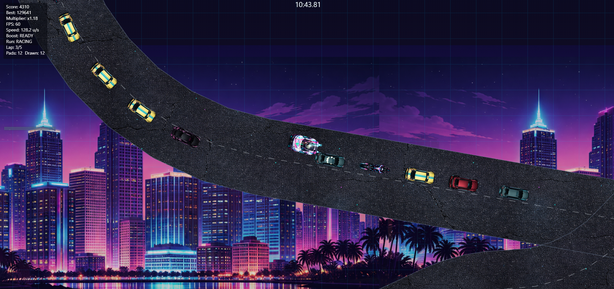
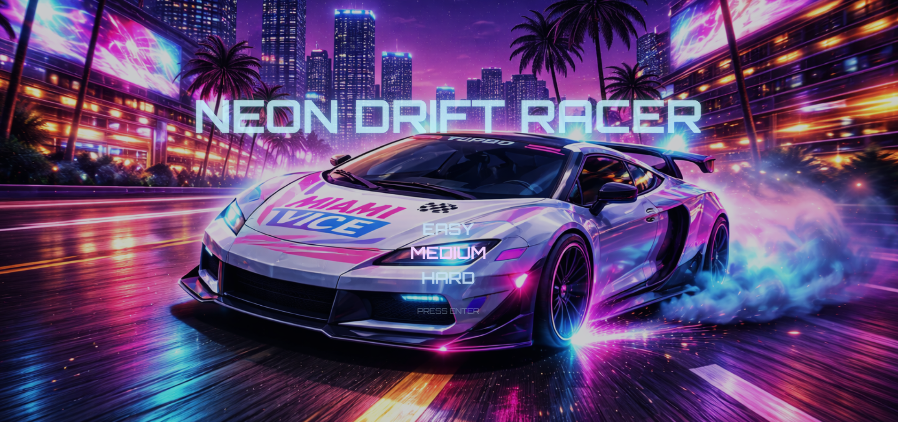
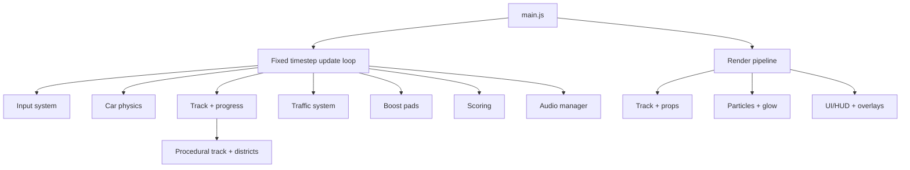

# Neon Drift Racer

Neon Drift Racer is a browser-based, neon-styled arcade racer focused on high-speed drifting, precision timing, and dense traffic navigation. It blends responsive drift physics, boost pad bursts, and a score-driven loop into a compact, replayable experience.

## Gameplay Screenshots

Screens show the traffic system, neon environments, boost pad layout, and HUD-driven scoring.

## High-Level Overview
Neon Drift Racer is a single-track arcade racer with an emphasis on tight control response, drift scoring, and readable visual feedback. The design goals are an immediate arcade feel, consistent high-speed handling, and replayability through score chasing and difficulty presets. The core loop is complete, with modular systems for traffic, boost pads, track generation, audio, UI, and scoring that support future expansion.

## Gameplay Features
- **Driving & drift physics:** Acceleration, braking, grip vs. drift damping, handbrake drift, and off-road penalties.
- **Traffic AI:** Lane-based NPC traffic with spacing control, near-miss detection, and collision response.
- **Boost pads:** Track-placed boost pads that trigger bursts, bonus trail effects, and drift score bonuses.
- **Lap system:** Multi-lap race flow with finish gate detection and split timing.
- **Countdown and race flow:** Pre-race delay, 3-2-1 countdown, and go flash transitions.
- **Difficulty selection:** Easy/Medium/Hard presets controlling traffic density, speed, and spacing.
- **Audio system:** Menu and gameplay music with crossfades and gesture-based unlock.
- **Start screen experience:** Animated neon title, difficulty menu, and confirm fade.

## How to Play
| Action | Keys | Notes |
| --- | --- | --- |
| Accelerate / Brake | `W/S` or `ArrowUp/ArrowDown` | Forward/reverse acceleration and braking |
| Steer | `A/D` or `ArrowLeft/ArrowRight` | Steering input |
| Handbrake Drift | `Space` | Induces drift and boosts trail effects |
| Trigger Boost Pads | Drive over pads | Boosts speed and trail effects |
| Start Race | `Enter` | Confirms difficulty selection |
| Menu Navigation | `W/S` or `ArrowUp/ArrowDown` | Moves selection on start screen |
| Restart / Return to Start | `R` | Returns to start screen and resets run |

## Debug & Developer Controls
| Key | Toggle | Effect |
| --- | --- | --- |
| `F1` or `Shift` + `/` | Help Overlay | Shows in-game controls and debug states |
| `C` | Car Render Mode | Toggle between sprite and placeholder triangle |
| `P` | Particles | Toggle trail and spark effects |
| `G` | Glow Pass | Toggle additive glow rendering |
| `M` | Motion Blur | Toggle screen-space motion blur |
| `H` | Skyline | Toggle skyline background rendering |
| `N` | Neon Props | Toggle neon roadside props |
| `L` | Lane Markings | Toggle lane line rendering |
| `T` | Track Debug | Show track boundaries, gates, and checkpoints |
| `K` | Prop Debug | Show prop bounds and district tagging |
| `J` | Collisions | Toggle track collision handling |
| `Y` | Traffic | Toggle NPC traffic update and render |
| `U` | Near Miss HUD | Toggle near-miss debug display |
| `I` | Bully Collide | Toggle player-to-NPC collision impulses |
| `F3` | Compact Debug Panel | Toggle compact vs. expanded debug HUD |
| `F4` | Manual Boost | Instant boost while racing (debug) |

## Game States & Flow
The game uses explicit states to keep UI, input, and simulation concerns isolated:
- **START_SCREEN**: Animated title and difficulty selection; race starts on `Enter`.
- **COUNTDOWN**: Pre-race delay, 3-2-1 countdown, and brief “RACE!” flash.
- **RACING**: Active driving, scoring, boosts, traffic, and lap tracking.
- **FINISHED**: Finish panel displays time, score, splits, and best results.

Transitions are managed by the race phase controller and reflected in the game state for rendering and input gating.

## Tech Stack
- **Language:** JavaScript (ES modules), HTML, CSS.
- **Rendering:** HTML5 Canvas 2D with glow, motion blur, and layered parallax skyline.
- **Audio:** HTMLAudioElement-based music manager with crossfade control.
- **Input:** Keyboard input system with per-frame pressed state tracking.
- **Storage:** `localStorage` persistence for best score and best time.
- **Runtime:** Browser-based, no build step required.

## System Architecture

## Project Structure
- `index.html`: Entry point, loads `src/main.js` as an ES module.
- `style.css`: Global layout and typography styling.
- `src/main.js`: Game loop, state machine, physics, rendering, and integration.
- `src/assets.js`: Asset loader for sprites and skyline images.
- `src/input.js`: Keyboard input state, pressed/released tracking, menu input.
- `src/track.js`: Procedural track generation, checkpoints, districts, progress.
- `src/traffic.js`: NPC traffic spawn, lane logic, spacing, and updates.
- `src/boostpads.js`: Boost pad placement and trigger logic.
- `src/score.js`: Drift scoring, multipliers, near-miss bonuses.
- `src/ui.js`: HUD, overlays, finish panel, start screen rendering.
- `src/audio.js`: Menu/gameplay music control and crossfades.
- `src/props.js`: Neon props and landmark placement.
- `src/particles.js`: Trail and spark particle pooling.
- `src/skyline.js`: Parallax skyline rendering utilities.
- `src/carRender.js`: Sprite-based car rendering helpers.
- `src/math.js`: Shared math helpers (vectors, clamp, lerp).
- `assets/`: Sprites, props, skylines, music, start screen artwork, screenshots.

## Extensibility & Future Work
- Add multiple track profiles by introducing additional track generators in `src/track.js`.
- Extend AI behavior in `src/traffic.js` (lane changes, overtakes, variable aggression).
- Introduce new gameplay modifiers in `src/score.js` (combo events, risk/reward bonuses).
- Add visual effects passes in `src/main.js` (screen-space bloom, color grading).
- Expand the start screen flow in `src/ui.js` (track selection, accessibility settings).

## Running the Project
1. Serve the folder using a local static server (ES modules require a server).
2. Open the served `index.html` in a modern browser.

Notes:
- Audio playback unlocks on the first user gesture (keyboard or pointer input).
- Best score and best time are stored in `localStorage`.